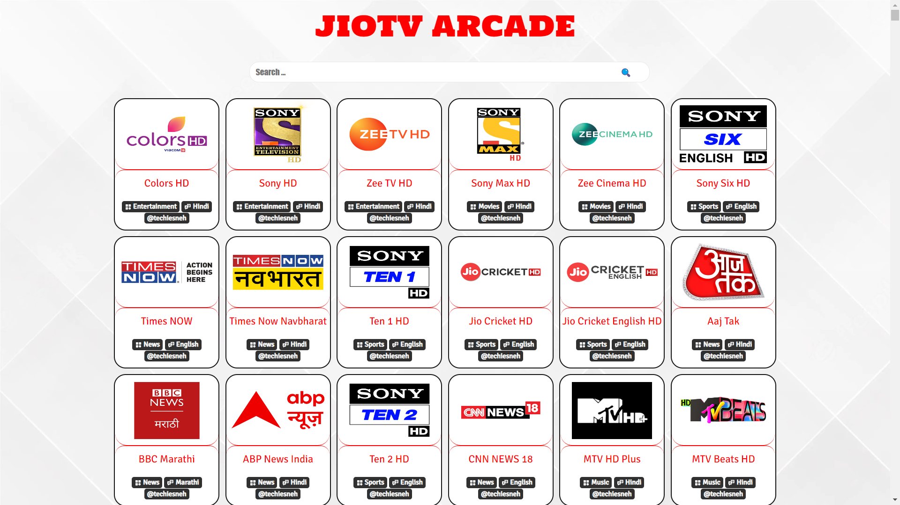
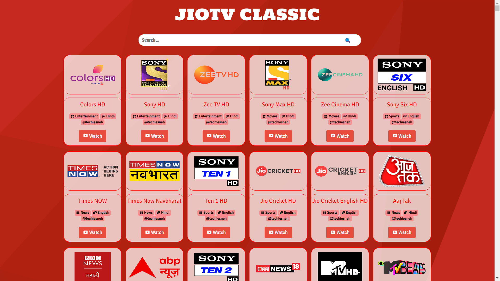
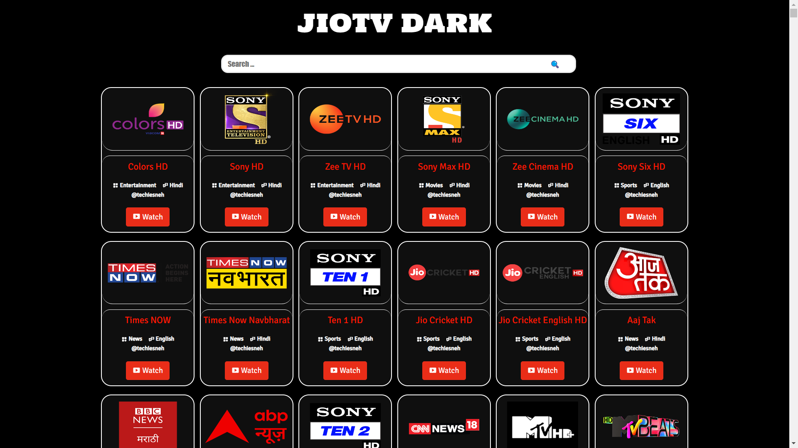

<h1 align='center'>✯ JɪᴏTV  Pʟᴀʏ 3.0 ✯</h1>

<!-- DO NOT EDIT FILE AND ADD YOU NAME HERE AND PUBLISH -->
<!-- © 2021-22 TechieSneh -->

<h4 align='center'>📺 The PHP Script For Grab Streaming Links and Play it , This Works Only on Android & Android TV
Through LocalHost <br><br>🌟 Star This Repositry Befor Copying 😎<br>😠 Don't Remove Credits<br>Don't Edit This Script
😈<br><br>Login With Your Own Credentials In This Script</h4>
<br>

<h2>😇 Features :</h2>

- HQ Streaming Free of Cost <br>
- Will Works In 250, 400, 600, 800, 1200(FEW NOT SUPPORT) in this Given Qualities
- Web Play Supports
- Works on Mobile, AndroidTV or PC Browser Perfect

<br>
<h2>💖 NEW FEATURES :</h2>

- Search Feature Added<br>

1. 🔍 SEARCH BY CHANNEL NAME 
```
e.g.  Sony,Zee,Star ...
```
2. 🔍 SEARCH BY GENRE 
```
e.g.  Entertainment,Kids,Movies,Music ...
```
3. 🔍 SEARCH BY LANGUAGE 
```
e.g.  Hindi,Tamil,Kannada,Odia ...
```

<br>

<h2>📸 SCREENSHOTS : </h2>


<br>


<br>

<h2>🍁 How To Use : </h2>

#### ♢ Method 1 :

1. First Download This Application<br>

- KSWEB PRO ( Php Web Server ) <br>

```py
https://dl1.apkhome.net/2019/6/KSWEB-3.93%20Pro.apk
```

```py
https://apkcow.com/ksweb-server-php-mysql-mod-apk/download/
```

```py
https://s3.dlandroid.com/apps/KSWEB-server[dlandroid.com].apk
```

2.  Then Download This Zip Files<br>

- [JioTV Zip](https://github.com/mitthu786/TS-JioTV/blob/main/tsjiotv.zip?raw=true) <br>

1. Locate & Extract all Files in LocalHost (Htdocs) Root Folder <br>
2. Open KSWEB App & Start The Server <br>
3. Run login.php file for a first time <br>
4. Put Your E-Mail or Mobile Number without +91 & Password in below Link <br>

```py
http://localhost:8080/tsjiotv/login.php
```
7. Now Open [JIOTV WEB] Below Link :

```py
http://localhost:8080/tsjiotv/
```

8. Click above link in any Browser . You Will See all Jio Channels . <br>
9. Click On Channel and Play <br>

#### ♢ Method 2 :

• In Player Put Links Format Like Below

  ```py
http://localhost:8080/tsjiotv/live.php?c=Channel_Name&q=Quality
  ```

```py
http://localhost:8080/tsjiotv/live.php?c=And_Pictures_HD&q=800
```

• Depending on Your Server Change Links
• This Script is free for USE and Modify</b><br>

#### ♢ Method 3 :

• In Tivimate or OTT Navigator Player Put Links Format Like Below :<br>

  ```py
http://localhost:8080/tsjiotv/playlist.php
  ```

• For Local Playlist :<br>

  ```py
http://localhost:8080/tsjiotv/localplaylist.m3u
  ```

• <b>FOR DIFFERENT QUALITY USE BELOW LINKS : </b><br>

  ```py
http://localhost:8080/tsjiotv/localplaylists/jio240p.m3u
  ```
• Now Change Above URL Like : jio240p to jio400p , jio600p ,etc. for Quality Change.</b>
• Hurrah !! Now Play & Enjoy with your Jio Channels .</b><br>

<!-- DO NOT EDIT FILE AND ADD YOU NAME HERE AND PUBLISH -->
<!-- © 2021-22 TechieSneh -->


<h2>📸 NEW THEMES SCREENSHOTS : </h2>

##### ♢♢ JIOTV ARCADE SHOTS [CLICK HERE](https://github.com/mitthu786/TS-JioTV/tree/main/themes/jiotv-arcade)



<br><br>

##### ♢♢ JIOTV CLASSIC SHOTS [CLICK HERE](https://github.com/mitthu786/TS-JioTV/tree/main/themes/jiotv-classic)



<br><br>

##### ♢♢ JIOTV LIGHTMODE SHOTS [CLICK HERE](https://github.com/mitthu786/TS-JioTV/tree/main/themes/jiotv-lightmode)


<br><br>

##### ♢♢ JIOTV DARKMODE SHOTS [CLICK HERE](https://github.com/mitthu786/TS-JioTV/tree/main/themes/jiotv-darkmode)



<br><br>

##### ♢♢ JIOTV PREMIUM SHOTS [CLICK HERE](https://github.com/mitthu786/TS-JioTV/tree/main/themes/jiotv-premium)


<br>


<br><br>

#### 😛 Generate ssoToken Here (HERE YOU GET DATA WITH OTP):

1. ✍️ FOR SSO TOKEN : [JioLogin](http://jiologin.unaux.com)<br>
2. For This You Need JioID Number and Password<br> 
3. You Can Also get Data with OTP

- `user` = Username / Mobile No.
- `pass` = Password

<br>

<h2>🚸 Warnings :</h2>

- This is Just For Educational Purpose
- DO NOT Sell this Script, This is 💯% Free

<h3>🤗 Meet Me : </h3>

• For any Support Join Our Group [Techie Sneh](https://telegram.me/techiesneh)<br>
• For Any Query Contact at [ProtonMail](mailto:techiesneh@protonmail.com)

<br>

---
<h4 align='center'>© 2021-22 Techie Sneh</h4>

<!-- DO NOT REMOVE THIS CREDIT -->
